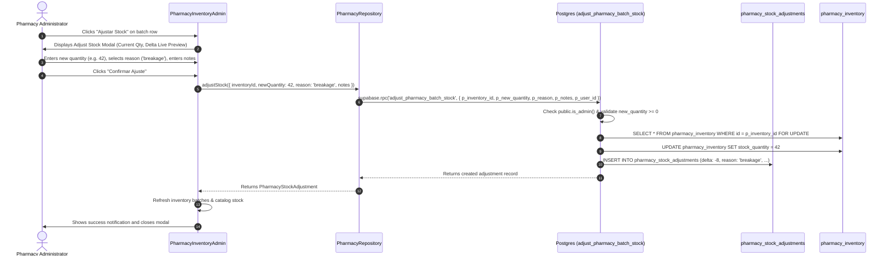
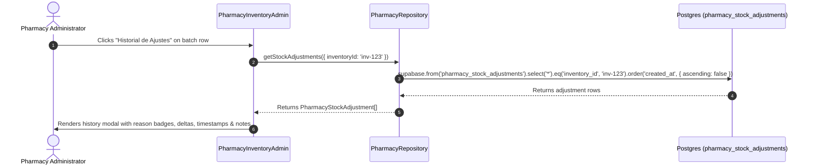

# Design: Pharmacy Stock Adjustments

## 1. Architectural Overview & Component Flow

The **Pharmacy Stock Adjustments** system provides an end-to-end audited workflow for adjusting stock quantities in the digital pharmacy inventory (`pharmacy_inventory`). It replaces direct, untracked inventory mutations with an atomic database function (`adjust_pharmacy_batch_stock`), an immutable audit log table (`pharmacy_stock_adjustments`), domain repository methods in `PharmacyRepository`, and administrative modal dialogs in `PharmacyInventoryAdmin.tsx`.

### High-Level Architecture Diagram

```mermaid
flowchart TD
    subgraph UI ["Frontend (React / TypeScript)"]
        PIA["PharmacyInventoryAdmin.tsx"]
        ASM["AdjustStockModal Component / Subview"]
        AHM["AdjustmentHistoryModal Component / Subview"]
        PIA --> ASM
        PIA --> AHM
    end

    subgraph Repo ["Data Access Layer"]
        PR["PharmacyRepository.ts"]
        ASM -->|adjustStock(payload)| PR
        AHM -->|getStockAdjustments(filters)| PR
    end

    subgraph Supabase ["Supabase / PostgreSQL"]
        RPC["RPC: adjust_pharmacy_batch_stock()"]
        RLS["Row Level Security Policies"]
        PI[("pharmacy_inventory")]
        PSA[("pharmacy_stock_adjustments (Audit Log)")]

        PR -->|supabase.rpc| RPC
        PR -->|supabase.from('pharmacy_stock_adjustments')| PSA
        RPC -->|1. SELECT ... FOR UPDATE| PI
        RPC -->|2. UPDATE stock_quantity| PI
        RPC -->|3. INSERT audit record| PSA
        RLS -.->|Protects| PSA
    end
```

### Component Interaction & Sequence Flow

#### A. Adjusting Stock Workflow


#### B. Querying Adjustment History Workflow


---

## 2. Database Schema (DDL)

### Table: `pharmacy_stock_adjustments`

```sql
-- Create table for immutable pharmacy inventory adjustments audit trail
CREATE TABLE IF NOT EXISTS public.pharmacy_stock_adjustments (
  id UUID PRIMARY KEY DEFAULT gen_random_uuid(),
  inventory_id UUID NOT NULL REFERENCES public.pharmacy_inventory(id) ON DELETE CASCADE,
  product_id UUID NOT NULL REFERENCES public.pharmacy_products(id) ON DELETE CASCADE,
  batch_number TEXT NOT NULL,
  user_id UUID REFERENCES auth.users(id) ON DELETE SET NULL,
  reason TEXT NOT NULL CHECK (
    reason IN (
      'physical_count',
      'breakage',
      'loss',
      'expired',
      'correction',
      'other'
    )
  ),
  previous_quantity INTEGER NOT NULL,
  new_quantity INTEGER NOT NULL CHECK (new_quantity >= 0),
  quantity_delta INTEGER NOT NULL,
  notes TEXT,
  created_at TIMESTAMPTZ NOT NULL DEFAULT NOW()
);

-- Comments for schema documentation
COMMENT ON TABLE public.pharmacy_stock_adjustments IS 'Registro inmutable de auditoría para ajustes de stock en lotes de farmacia.';
COMMENT ON COLUMN public.pharmacy_stock_adjustments.reason IS 'Motivo clasificado: physical_count, breakage, loss, expired, correction, other.';
COMMENT ON COLUMN public.pharmacy_stock_adjustments.quantity_delta IS 'Diferencia calculada (new_quantity - previous_quantity). Positivo para ingresos, negativo para egresos.';

-- Indexes for efficient querying by inventory batch, product, and creation date
CREATE INDEX IF NOT EXISTS idx_pharmacy_stock_adjustments_inventory_id 
  ON public.pharmacy_stock_adjustments(inventory_id);

CREATE INDEX IF NOT EXISTS idx_pharmacy_stock_adjustments_product_id 
  ON public.pharmacy_stock_adjustments(product_id);

CREATE INDEX IF NOT EXISTS idx_pharmacy_stock_adjustments_created_at 
  ON public.pharmacy_stock_adjustments(created_at DESC);
```

---

## 3. Atomic RPC Function Specification

### Function: `adjust_pharmacy_batch_stock`

The stored procedure handles concurrency safely by locking the specific `pharmacy_inventory` row (`FOR UPDATE`), computing the exact delta, updating the batch inventory, inserting the audit log, and returning the newly created record.

```sql
CREATE OR REPLACE FUNCTION public.adjust_pharmacy_batch_stock(
  p_inventory_id UUID,
  p_new_quantity INTEGER,
  p_reason TEXT,
  p_notes TEXT DEFAULT NULL,
  p_user_id UUID DEFAULT NULL
)
RETURNS public.pharmacy_stock_adjustments
LANGUAGE plpgsql
SECURITY DEFINER
SET search_path = public
AS $$
DECLARE
  v_inventory RECORD;
  v_adjustment public.pharmacy_stock_adjustments%ROWTYPE;
  v_delta INTEGER;
  v_actor_id UUID;
BEGIN
  -- 1. Security Check: Caller must be an admin
  IF NOT public.is_admin() THEN
    RAISE EXCEPTION 'Acceso denegado: Solo los administradores pueden realizar ajustes de stock.'
      USING ERRCODE = '42501';
  END IF;

  -- 2. Validation: New quantity cannot be negative
  IF p_new_quantity < 0 THEN
    RAISE EXCEPTION 'La cantidad de stock no puede ser negativa (recibido: %).', p_new_quantity
      USING ERRCODE = '22003';
  END IF;

  -- 3. Validation: Reason must match allowed check constraint
  IF p_reason NOT IN ('physical_count', 'breakage', 'loss', 'expired', 'correction', 'other') THEN
    RAISE EXCEPTION 'Motivo de ajuste inválido: "%". Motivos permitidos: physical_count, breakage, loss, expired, correction, other.', p_reason
      USING ERRCODE = '22023';
  END IF;

  -- 4. Concurrency lock: Lock the target inventory row
  SELECT id, product_id, batch_number, stock_quantity
  INTO v_inventory
  FROM public.pharmacy_inventory
  WHERE id = p_inventory_id
  FOR UPDATE;

  -- 5. Validation: Ensure the batch exists
  IF NOT FOUND THEN
    RAISE EXCEPTION 'Lote de inventario con ID "%" no encontrado.', p_inventory_id
      USING ERRCODE = 'P0002';
  END IF;

  -- 6. Calculate Delta
  v_delta := p_new_quantity - v_inventory.stock_quantity;

  -- 7. Update inventory stock
  UPDATE public.pharmacy_inventory
  SET stock_quantity = p_new_quantity
  WHERE id = p_inventory_id;

  -- 8. Resolve actor user_id
  v_actor_id := COALESCE(p_user_id, auth.uid());

  -- 9. Insert audit record into pharmacy_stock_adjustments
  INSERT INTO public.pharmacy_stock_adjustments (
    inventory_id,
    product_id,
    batch_number,
    user_id,
    reason,
    previous_quantity,
    new_quantity,
    quantity_delta,
    notes,
    created_at
  ) VALUES (
    v_inventory.id,
    v_inventory.product_id,
    v_inventory.batch_number,
    v_actor_id,
    p_reason,
    v_inventory.stock_quantity,
    p_new_quantity,
    v_delta,
    p_notes,
    NOW()
  )
  RETURNING * INTO v_adjustment;

  -- 10. Return the inserted audit record
  RETURN v_adjustment;
END;
$$;

COMMENT ON FUNCTION public.adjust_pharmacy_batch_stock IS 'Ajusta atómicamente el stock de un lote de farmacia con bloqueo de fila y genera el registro inmutable de auditoría.';
```

---

## 4. Row Level Security & Security Policies

To preserve complete audit trail integrity:
- **SELECT**: Restricted to authenticated administrators using `public.is_admin()`.
- **INSERT**: Allowed for authenticated administrators (or via the `SECURITY DEFINER` RPC function).
- **UPDATE**: **Explicitly forbidden** (no update policy created) to guarantee immutability.
- **DELETE**: **Explicitly forbidden** (no delete policy created) to prevent tampering with historical records.

```sql
-- Enable RLS
ALTER TABLE public.pharmacy_stock_adjustments ENABLE ROW LEVEL SECURITY;

-- Policy: Admin Select
DROP POLICY IF EXISTS "Admins can view pharmacy stock adjustments" ON public.pharmacy_stock_adjustments;
CREATE POLICY "Admins can view pharmacy stock adjustments"
  ON public.pharmacy_stock_adjustments
  FOR SELECT
  TO authenticated
  USING (public.is_admin());

-- Policy: Admin Insert (Direct or RPC)
DROP POLICY IF EXISTS "Admins can insert pharmacy stock adjustments" ON public.pharmacy_stock_adjustments;
CREATE POLICY "Admins can insert pharmacy stock adjustments"
  ON public.pharmacy_stock_adjustments
  FOR INSERT
  TO authenticated
  WITH CHECK (public.is_admin());
```

---

## 5. TypeScript Domain Types & Repository Layer

### A. TypeScript Contracts (`src/types.ts`)

```typescript
export type StockAdjustmentReason =
  | 'physical_count'
  | 'breakage'
  | 'loss'
  | 'expired'
  | 'correction'
  | 'other';

export interface PharmacyStockAdjustment {
  id: string;
  inventoryId: string;
  productId: string;
  batchNumber: string;
  userId?: string | null;
  reason: StockAdjustmentReason;
  previousQuantity: number;
  newQuantity: number;
  quantityDelta: number;
  notes?: string | null;
  createdAt: string;
}

export interface AdjustBatchStockPayload {
  inventoryId: string;
  newQuantity: number;
  reason: StockAdjustmentReason;
  notes?: string;
  userId?: string;
}
```

### B. Repository Implementation (`src/repositories/PharmacyRepository.ts`)

```typescript
// Additions to PharmacyRepository class:

/**
 * Ejecuta un ajuste auditado de stock para un lote de farmacia invocando la RPC atómica.
 */
async adjustStock(payload: AdjustBatchStockPayload): Promise<PharmacyStockAdjustment> {
  const { data, error } = await supabase.rpc('adjust_pharmacy_batch_stock', {
    p_inventory_id: payload.inventoryId,
    p_new_quantity: payload.newQuantity,
    p_reason: payload.reason,
    p_notes: payload.notes || null,
    p_user_id: payload.userId || null,
  });

  if (error) {
    console.error('Error al realizar ajuste de stock en farmacia:', error);
    throw error;
  }

  return {
    id: data.id,
    inventoryId: data.inventory_id,
    productId: data.product_id,
    batchNumber: data.batch_number,
    userId: data.user_id,
    reason: data.reason as StockAdjustmentReason,
    previousQuantity: Number(data.previous_quantity),
    newQuantity: Number(data.new_quantity),
    quantityDelta: Number(data.quantity_delta),
    notes: data.notes,
    createdAt: data.created_at,
  };
}

/**
 * Obtiene el historial de ajustes de stock, opcionalmente filtrado por lote o producto.
 */
async getStockAdjustments(filters?: {
  inventoryId?: string;
  productId?: string;
}): Promise<PharmacyStockAdjustment[]> {
  let query = supabase
    .from('pharmacy_stock_adjustments')
    .select('*')
    .order('created_at', { ascending: false });

  if (filters?.inventoryId) {
    query = query.eq('inventory_id', filters.inventoryId);
  }
  if (filters?.productId) {
    query = query.eq('product_id', filters.productId);
  }

  const { data, error } = await query;

  if (error) {
    console.error('Error obteniendo historial de ajustes:', error);
    throw error;
  }

  return (data || []).map((row: any) => ({
    id: row.id,
    inventoryId: row.inventory_id,
    productId: row.product_id,
    batchNumber: row.batch_number,
    userId: row.user_id,
    reason: row.reason as StockAdjustmentReason,
    previousQuantity: Number(row.previous_quantity),
    newQuantity: Number(row.new_quantity),
    quantityDelta: Number(row.quantity_delta),
    notes: row.notes,
    createdAt: row.created_at,
  }));
}
```

---

## 6. Frontend Component Architecture & State Flow

Inside `src/pages/admin/PharmacyInventoryAdmin.tsx`:

### Reason Label & Badge Helpers

```typescript
export const STOCK_ADJUSTMENT_REASONS: Array<{ value: StockAdjustmentReason; label: string; badgeColor: string }> = [
  { value: 'physical_count', label: 'Conteo Físico', badgeColor: 'bg-blue-500/10 text-blue-400 border-blue-500/30' },
  { value: 'breakage', label: 'Rotura / Daño', badgeColor: 'bg-amber-500/10 text-amber-400 border-amber-500/30' },
  { value: 'loss', label: 'Pérdida / Extravío', badgeColor: 'bg-rose-500/10 text-rose-400 border-rose-500/30' },
  { value: 'expired', label: 'Vencimiento', badgeColor: 'bg-purple-500/10 text-purple-400 border-purple-500/30' },
  { value: 'correction', label: 'Corrección Administrativa', badgeColor: 'bg-teal-500/10 text-teal-400 border-teal-500/30' },
  { value: 'other', label: 'Otro', badgeColor: 'bg-slate-500/10 text-slate-400 border-slate-500/30' },
];
```

### State Variables in `PharmacyInventoryAdmin`

```typescript
// Adjustment Modal State
const [adjustingBatch, setAdjustingBatch] = useState<PharmacyInventory | null>(null);
const [adjNewQuantity, setAdjNewQuantity] = useState<number>(0);
const [adjReason, setAdjReason] = useState<StockAdjustmentReason>('physical_count');
const [adjNotes, setAdjNotes] = useState<string>('');

// History Modal State
const [historyBatch, setHistoryBatch] = useState<PharmacyInventory | null>(null);
const [adjustmentsList, setAdjustmentsList] = useState<PharmacyStockAdjustment[]>([]);
const [loadingHistory, setLoadingHistory] = useState<boolean>(false);
```

### UI Interaction in Batch Cards

In the batches list of Tab 2 (`batches`), each batch row displays:
- Left: Batch Number & Expiry Date (`Calendar` icon).
- Center-Right: Action buttons:
  - Button 1: **"Ajustar"** (`Edit3` icon) -> triggers `handleOpenAdjustModal(inv)`
  - Button 2: **"Historial"** (`History` / `Clock` icon) -> triggers `handleOpenHistoryModal(inv)`
- Right: Current Stock Quantity (`{inv.stockQuantity} un.`).

### Modal 1: Adjust Stock Modal UI Specification
- Header: Product Name + Active Ingredient, Batch Number badge.
- Current Stock display: Static indicator showing `{adjustingBatch.stockQuantity} unidades actuales`.
- Inputs:
  - `newQuantity`: Number input (`min="0"`, `step="1"`), initialized with `adjustingBatch.stockQuantity`.
  - Dynamic Delta Preview: Calculated in real-time `delta = adjNewQuantity - adjustingBatch.stockQuantity`:
    - `delta > 0`: `+{delta} un.` in Emerald (`text-emerald-400 bg-emerald-500/10 border-emerald-500/30`)
    - `delta < 0`: `{delta} un.` in Rose (`text-rose-400 bg-rose-500/10 border-rose-500/30`)
    - `delta === 0`: `0 un. (Sin cambio)` in Slate (`text-slate-400 bg-slate-800 border-white/5`)
  - `reason`: Select dropdown with Spanish descriptions.
  - `notes`: Optional textarea for detailed explanation.
- Actions: "Cancelar" and "Confirmar Ajuste" (disabled when `isSubmitting` or `adjNewQuantity < 0`).

### Modal 2: Adjustment History Modal UI Specification
- Header: Product Name + Batch Number (`Lote: {historyBatch.batchNumber}`).
- Content:
  - When `loadingHistory`: Spinner / skeleton loading state.
  - When empty: "No se registran ajustes de stock para este lote."
  - When data present: Table / list showing:
    - Date & Time (`new Date(adj.createdAt).toLocaleString('es-AR')`)
    - Reason badge with assigned color
    - Previous -> New quantity with Delta badge (`+10` or `-5`)
    - Notes (or "Sin observaciones")
    - User ID attribution

---

## 7. Migration & Rollback Strategy

### Migration File Name
`supabase/migrations/20260917000000_pharmacy_stock_adjustments.sql`

### Up Migration Steps
1. Create table `public.pharmacy_stock_adjustments`.
2. Add table and column comments.
3. Create indexes on `inventory_id`, `product_id`, and `created_at DESC`.
4. Enable RLS and define SELECT and INSERT policies.
5. Create function `public.adjust_pharmacy_batch_stock` with `SECURITY DEFINER` and `is_admin()` check.

### Down Migration / Rollback Script
```sql
-- Down migration for pharmacy_stock_adjustments
DROP FUNCTION IF EXISTS public.adjust_pharmacy_batch_stock(UUID, INTEGER, TEXT, TEXT, UUID);
DROP TABLE IF EXISTS public.pharmacy_stock_adjustments CASCADE;
```
Rollback of client code is completely non-breaking as existing catalog and batch inventory rows remain untouched.
